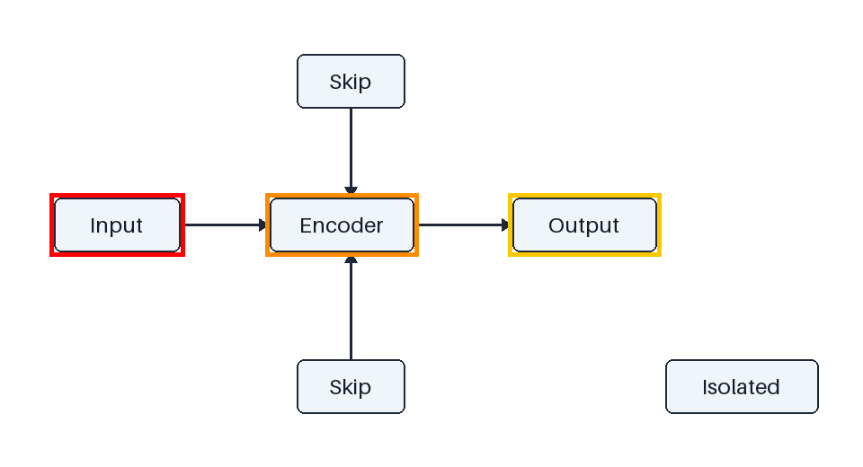

<h1 align="center">🔬 SciFigBench-Jittor</h1>

  <strong>Read the labels. Follow the arrows. Evaluate scientific figure understanding.</strong>

  
  
  
  
  

  <a href="#news">News</a> ·
  <a href="#quick-start">Quick Start</a> ·
  <a href="#tasks">Tasks</a> ·
  <a href="#usage">Usage</a> ·
  <a href="#documentation">Documentation</a> ·
  <a href="#citation">Citation</a>

---

> [!NOTE]
> **Code preview · synthetic examples only.** The SciFigBench dataset is undergoing
> second-pass validation. This repository contains the evaluation toolkit and
> original synthetic examples; it does not include the benchmark dataset or final
> benchmark results. Synthetic scores are software checks, not model scores.

## 🔥 News

- **[Sep. 8, 2026]** Our paper has been accepted to **EMNLP 2026 Main Conference**! 🎉

## 👋 Overview

Scientific figures carry information in both **what they say** and **how their
parts connect**. SciFigBench studies these abilities through five tasks, from
reading boxed text to tracing information through a diagram.

SciFigBench-Jittor turns your QA and model responses into task-specific evaluation
reports using **Jittor CPU computation**, with a shared workflow:

**Validate the questions → Render the visual references → Evaluate the responses.**

  

  <em>One original diagram, 11 synthetic questions, five ways to test understanding. 
  Shown here: read the text in red → orange → yellow order.</em>

- **Five task scorers, powered by Jittor.** Token edit distance, accuracy,
  LaTeX-aware ANLS and score reductions execute through Jittor in float64.
  SciPy supplies the exact assignment indices for set-ANLS*.
- **An example you can inspect.** Synthetic QA, correct and mixed predictions,
  rendered inputs and expected reports are included.
- **Results you can trace.** Reports record input hashes, versions, coverage,
  missing responses, parse failures and subgroup scores.

## 🚀 Quick Start

You need **Linux (Ubuntu recommended) or WSL2**, **Python 3.10–3.12**, and a C++
compiler. Evaluation runs on the CPU in one process. No PyTorch, Accelerate,
xformers, distributed launcher, GPU or model API is required.

On Ubuntu/WSL2, prepare the build dependencies:

~~~bash
sudo apt-get update
sudo apt-get install -y build-essential python3-dev python3-venv libomp-dev
python3 -m venv .venv
source .venv/bin/activate
~~~

Use a Python interpreter in the supported range; when installing another Python
version, install its matching development headers and venv package as well.
On Windows, run these commands **inside WSL2**. Native Windows and GPU evaluation
are outside this preview's supported execution environments.

Use Ubuntu 22.04's Python 3.10 for the shortest setup. Jittor's CPU runtime skips
optional CUDA and MKL initialization when loaded by this toolkit.

From this repository's root, install the toolkit:

~~~bash
python -m pip install -e .
scifigbench --version
~~~

> [!TIP]
> Jittor compiles its runtime and evaluation operators on the first scoring run,
> so the first run takes longer. Keep the compiler available for subsequent runs;
> compiled artifacts are cached. `validate`, `render` and `--version` do not
> initialize Jittor. See the [Jittor installation guide](https://cg.cs.tsinghua.edu.cn/jittor/download/)
> for compiler setup details. For machines with limited RAM, set
> `DISABLE_MULTIPROCESSING=1` to compile serially; `use_mkl=0` avoids optional MKL setup.

Then run the complete example:

~~~bash
python examples/synthetic/run_demo.py --out-dir reports/synthetic
~~~

This validates all **11 questions**, renders their visual inputs, and evaluates
both prediction sets across **all five tasks**. Correct predictions score **1.0**
on each task; mixed predictions demonstrate partial credit, missing responses
and parse failures. The script checks the results against hand-specified
[expected values](examples/synthetic/expected.json).

Explore the outputs in `reports/synthetic/`:

~~~text
reports/synthetic/
├── rendered/    # Model-facing images, grouped by task
├── correct/     # Reports for the correct predictions
└── mixed/       # Reports for deliberately imperfect predictions
~~~

To repeat a run in the same destination, add `--overwrite`. You can also browse
the committed [example outputs](examples/synthetic/expected-output/) immediately.

## 🧩 Five Tasks, One Diagram

The examples below refer to the synthetic diagram above. Each task uses its own
visual references; the displayed colored boxes illustrate the Dense task.

| Task | Example question | Example answer | Primary metric |
|---|---|---|---|
| **Dense Content Perception** | What do the red, orange and yellow boxes say? | `["Input", "Encoder", "Output"]` | Token-level ANLS; positions matter for multiple boxes |
| **Edge-Level Verification** | Is there a direct edge from Input to Encoder? | `true` | Accuracy |
| **Node-Level Degree Counting** | How many edges enter Encoder? | `3` | Accuracy |
| **Path-Level Reachability** | Can Input reach Output? | `true` | Accuracy |
| **Information-Flow Tracing** | Which neighbor texts feed directly into Encoder? | `["Input", "Skip", "Skip"]` | Optimal-assignment set-ANLS* |

The two **Skip** labels belong to different nodes, so both appear in the
information-flow answer. See the [task definitions](docs/tasks.md) for direction,
parallel-edge, color-order and answer-format conventions.

## 💽 Usage

For a closer look, run one task through the three commands below from the
repository root.

**1. Validate the QA.** Check required fields, IDs, answers and box coordinates.

~~~bash
scifigbench validate --qa examples/synthetic/qa/edge_level_verification.jsonl
~~~

**2. Render the inputs.** Draw the red source and blue target boxes specified by
each question. Image paths are resolved relative to `--data-root`.

~~~bash
scifigbench render --qa examples/synthetic/qa/edge_level_verification.jsonl --data-root examples/synthetic --out-dir rendered/edge
~~~

**3. Evaluate the predictions.** Compare model responses with the supplied answers.

~~~bash
scifigbench evaluate --task edge_level_verification --qa examples/synthetic/qa/edge_level_verification.jsonl --pred examples/synthetic/predictions/correct/edge_level_verification.jsonl --report-dir reports/correct
~~~

This example produces **accuracy 1.0**, **coverage 1.0**, and zero missing or
unparseable responses. Its outputs are:

~~~text
reports/correct/edge_level_verification/
├── report.json
└── per_question__edge_level_verification.jsonl
~~~

Existing task report directories require `--overwrite`. Run
`scifigbench --help` or `scifigbench evaluate --help` to explore the options;
the CLI is also available as `python -m scifigbench`.

### Bring your own predictions

Provide your own QA JSONL and a prediction file with one row per submitted qid:

~~~json
{"qid": "SYN-edge-positive", "response": "true"}
~~~

Each evaluation selects **one task**. Prediction IDs must belong to that task;
duplicate and unknown IDs are errors. Native string arrays and JSON-encoded
string arrays are supported for the list-answer tasks.

Missing and unparseable predictions score zero, and every QA contributes to the
task denominator. Reports contain input SHA-256 hashes, software/schema/data
versions, Jittor/SciPy versions, CPU/float64 execution metadata, coverage and subgroup metrics.
There is no combined score across the
five tasks. Read the [input format](docs/data-format.md) and
[evaluation policy](docs/evaluation.md) before preparing a custom run.

## 📚 Documentation

| I want to… | Start here |
|---|---|
| Understand the five tasks | [Task definitions](docs/tasks.md) |
| Prepare QA and predictions, or read reports | [Data format and schemas](docs/data-format.md) |
| Understand parsing, ANLS and missing-answer policy | [Evaluation policy](docs/evaluation.md) |
| Inspect or regenerate the synthetic example | [Synthetic examples](examples/synthetic/README.md) |
| Check the status of the benchmark data | [Data availability](DATA_AVAILABILITY.md) |
| Trace the code to its source revision | [Code provenance](PROVENANCE.md) |
| See what is included in this preview | [Release notes](docs/release-notes.md) · [Changelog](CHANGELOG.md) |

<strong>📦 Packages and installation options</strong>

The distribution package is named `scifigbench-jittor`; the Python import and
CLI are named `scifigbench`.

- **Source distribution:** code, docs, tests and synthetic examples.
- **Wheel:** importable package, three bundled JSON Schemas and license.
  Install a downloaded wheel with `python -m pip install <wheel-file>`;
  use a source checkout or source distribution to access the demo files.

Preview assets are prepared for
[GitHub Releases](https://github.com/LeNcyer/SciFigBench-jittor/releases).
There is no PyPI release. Toolkit version **0.2.0**, report schema version **1.1** and
dataset versions are tracked separately; the example data is **synthetic-v1**.
QA and prediction formats remain compatible with 0.1.0. The report schema also
accepts legacy 1.0 reports that do not contain execution metadata.

When migrating from `scifigbench-toolkit`, create a fresh virtual environment:
the two distributions share the same import name and must not be installed together.

## 🛠️ Development

Install the development dependencies, run the checks and build the packages:

~~~bash
python -m pip install -e ".[dev]"
python -m pytest
python -m ruff check .
python -m build
~~~

For locked development dependencies with `uv`:

~~~bash
uv sync --frozen --extra dev
uv run --frozen --extra dev python -m pytest
~~~

The [CI workflow](.github/workflows/tests.yml) is configured to test Jittor CPU
evaluation on Ubuntu with Python 3.10, 3.11 and 3.12. It builds the distributions and runs actual
Jittor operators and the complete demo against an installed wheel outside the
source checkout, without PyTorch, Accelerate or xformers installed.

## 💫 Contributing

Bug reports, documentation improvements and focused pull requests are welcome.
For an evaluation issue, include the toolkit version, command, a small synthetic
QA/prediction example, and the expected and actual behavior in an
[issue](https://github.com/LeNcyer/SciFigBench-jittor/issues).

## ✍️ Citation & License

**MIT**, copyright 2026 SciFigBench authors. The original synthetic figures and
questions use the same license. See [LICENSE](LICENSE) and
[CITATION.cff](CITATION.cff).

When citing this code preview, identify **SciFigBench-Jittor, version 0.2.0**
and the planned tag `v0.2.0-preview`. Dataset availability and future benchmark
versions are tracked separately in [Data availability](DATA_AVAILABILITY.md).
